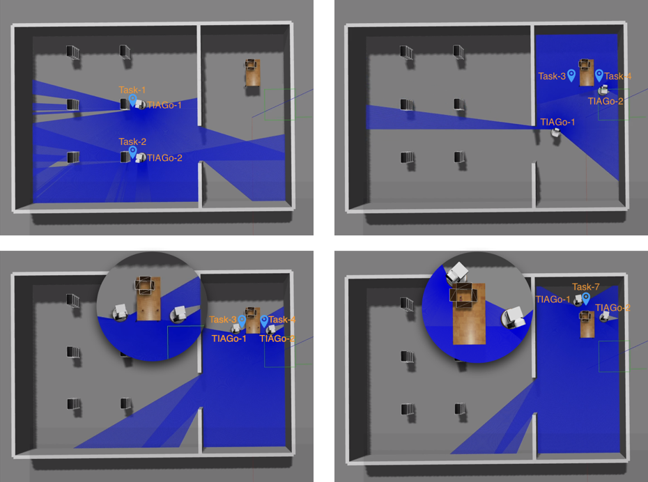

# PRobPlan

PRobPlan: A Framework of Integrating Probabilistic Planning into ROS.

We propose a framework, called PRobPlan (PRobabilistic Robot Planning). Our framework uses a series of generation programs to build a problem file instead of the knowledge base. This makes it more modifiable. On the other hand, our framework integrates a state-of-the-art planner, SOGBOFA, and enhances it with a new recommendation function. This makes it more scalable. We instantiate the proposed framework in a warehouse-robot domain where mobile robots are allocated tasks of fetching or packing goods. Both of the domain and problem instances are modeled with RDDL (Relational Dynamic Influence Diagram Language). Experimental results showed the effectiveness of the proposed framework. 

## ROS simulated warehouse domain 

###  Simulated Vedio

Please refer to this link:

[ROS Simulation on YouTube](https://youtu.be/mmgoIH_CILo)

### Requirements

- Run Planner: Java SE 8 or higher
- ROS simulation: Ubuntu 16.04, ROS Kinetic and Gazebo 7.

### Command

- launch simulation: `gazebo` and `rviz`

`roslaunch probplan_sim probplan_gazebo_sim.launch`

- launch PRobPlan

`rosrun probplan_sim plan_to_ros_main.py`

### Results

